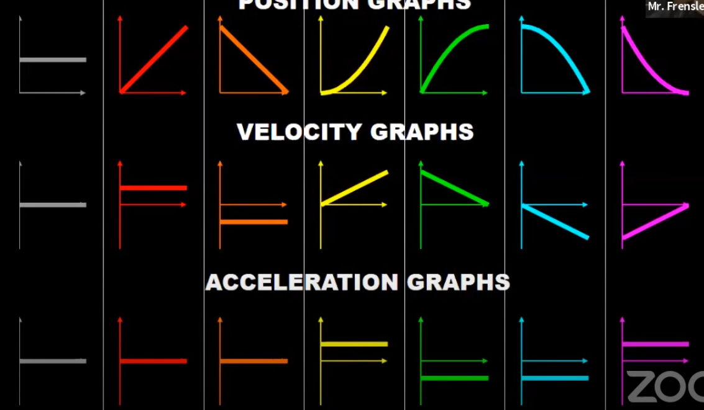

# AP CMech Notes

# 1.) Kinematics

- **Four Primary Equations**

    # **Used when '*a*' is constant**

    $$1.)\ \Delta x=\frac{1}{2}(v_f-v_i)\Delta t \text{ -\\- no } a$$

    $$2.)\ v_f=v_i+a\Delta t \text{ -\\- no } x$$

    $$3.1)\ \Delta x=v_i \Delta t+\frac{1}{2}a \Delta t^2 \text{ -\\- no } v_f$$

    $$3.2)\ \Delta x=v_f \Delta t-\frac{1}{2}a \Delta t^2 \text{ -\\- no } v_i$$

    $$4)\ v_f^2=v_i^2+2a \Delta x \text{ -\\- no } t$$

- Desmos
    - Projectile

        [https://www.desmos.com/calculator/gjnco6mzjo](https://www.desmos.com/calculator/gjnco6mzjo)

    - Displacement, Velocity, and Acceleration

        [https://www.desmos.com/calculator/z9xgzjmhfp](https://www.desmos.com/calculator/z9xgzjmhfp)

- Slope and Area

    

    Top is x, middle is v, bottom is a

    

    

- Projectile Motion

    $$t_{top}=\frac{v_i*sin\theta}{g} \text{ -\\- half of parabolic flight time}$$

    $$y_{max}=\frac{v_i*sin^2\theta}{2g} \text{ -\\- peak in y direction}$$

    $$x_{max}=\frac{v_i*sin2\theta}{g} \text{ -\\- distance traveled in x direction}$$

- FRQ

    Graphs

    

    Changing Acceleration / Velocity

    

- Example Qs

    1:

    

    

    2:

    

    

    3:

    

    

    4:

    

    

    5:

    

    

    6:

    

    

    7:

    

    

    8:

    

    

    9. 

    

    

# 2.) Forces

- N = kg m/s^2 -- a force of 1N causes a 1kg mass to accelerate at 1ms^-2
- Normal doesn't always equal mg!
- Friction
    - Kinetic friction only acts when the force breaks past the static friction threshhold
    - The friction force is always the **lesser** of mu*N or the force it's resisting

    $$F_s \le \mu_s \cdot F_N$$

- Spring

    $$F_{spring} = -kx$$

    $$k=\frac{\Delta F}{\Delta x}$$

    - Thus, the slope (delta y / delta x) of a force vs. distance is k
- Centripital

    $$F_{centripetal} = \frac{mv^2}{r}$$

- Gravity

    $$mgsin(θ) = F_{gx} \text{ -\\- Acceleration down ramp w/no friction}$$

    $$mgcos(θ) = F_{gy} \text{ -\\- Normal force when no other forces act in the y direction}$$

- Pulleys + Atwoods

    $$\text{Acceleration of a Pulley} = \frac{Mg}{m+M} = \frac{Mg-\mu mg}{m+M}$$

- Drag Force
    - Drag on x-axis:

        

    - Drag on y-axis:

        

        

- FRQs

    Drag

    

    Multiple Bodies (pulleys, carts)

    

- Practice Qs

    1.

    

    

    2.

    

    

    3.

    

    

    4.

    

    

    5.

    

    

    a = 1t, not .1t

    6.

    

    

    7. 

    

    

    8.

    

    

    9. 

    

    

    10.

    

    

    11. 

    

    

    12.

    

    

    13. 

    

    

    16.

    

    

# 3.) Energy

- Work + KE  — Force and Distance

    $$W = \int (F) dx =  \vec F \parallel  x = +\Delta KE = -\Delta PE = \int P dt$$

    - Force parallel to distance traveled
    - If force is opposing motion and acceleration changes, work stays the same
- Potential

    $$F = -\frac{dU}{dx}$$

    - Potential Energy can only depend on position
    - Negative relation with force indicates that the direction of the force is always towards lower PE
    - Derivation

        

- Conservation

    Consider the total work done by a force that acts on a particle as the particle moves around a closed path and returns to its starting point. If this total work is zero, we call the force a conservative force. If the total work for the round trip is not zero, we call the force a non-conservative force.

    Consider the work done by a force that acts on an object as the object moves from an initial position to a final position along any arbitrarily chosen path. If this work is the same for all such paths, we call the force a conservative force. If the work is not the same for all paths, we call the force a non-conservative force.

    $$\Delta K + \Delta U + (\Delta E_{int})= W_{ext}$$

    - Conservative  — NO external forces
        - Mechanical Energy conserved; ME = ME'
        - Gravity, Spring Force
        - Always have a potential energy associated with it
        - Conservative force's magnitude and direction only depend on the object's location, not on how the object is moving
    - Non-conservative  — external force present
        - Mechanical Energy lost; ME > ME'
        - Friction, Air resistance (drag)
    - Internal Energy

        

- Power

    $$P=\frac{dW}{dt}=\frac{dKE}{dt}=\frac{W}{t}=\vec F \cdot \vec v$$

    - Rate at which work is done
- Springs

    $$W_{spring}=\int F_{spring} dx= \int (-kx)dx = -\frac{1}{2}kx^2 $$

    $$U_{spring} = -W_{spring}=\frac{1}{2}kx^2$$

    - Springs are most compressed in collisions when velocity of both objects are equal
        - Therefore, we can treat the system as inelastic at that moment
        - Steps

            

- Rotation

    [Rotational Energy](https://www.notion.so/0056a5c6d9dc4c6fa49d3215643ae908)

- Equilibrium
    - Neutral Equilibrium is where the Potential Energy of the object remains constant regardless of
    position. For example, a ball rolling on a level surface.
    - Stable Equilibrium is where the Potential Energy of the object increases as the position of the
    object moves away from the equilibrium position and therefore the object naturally returns to the
    equilibrium position. For example, a water bottle being tipped to the side.
    - Unstable Equilibrium is where the Potential Energy of the object decreases as the position of the
    object moves away from the equilibrium position and therefore the object naturally moves away
    from the equilibrium position. For example, a marker being tipped to the side.

    

- Practice Qs

    1.

    

    

    2.

    

    

    

    2.5

    

    

    3.

    

    

    4.

    

    

    4.5

    

    

    5.

    

    

    6. 

    

    

    7.

    

    

    8.

    

    

    9. 

    

    

    10.

    

    

    11.

    

    

    12.

    

    

    13. 

    

    

    14. 

    

    

    15.

    

    

    16

    

    

# 4.) Momentum

- Collisions
    - Elastic — bounce off
        - KE conserved
        - Momentum conserved (while no unbalanced ext forces)
        - If the final velocity of an object is less than half of the initial velocity of the object (v_i/2), then the object it's colliding with has more mass

        $$v_1+v_1'=v_2+v_2'$$

        $$v_1'=\frac{m_1-m_2}{m_1+m_2}v_1$$

        $$v_2'=\frac{2m_1}{m_1+m_2}v_2$$

    - Inelastic — Stick
        - KE lost
        - Momentum conserved (while no unbalanced ext forces)
    - Maximum speed when m << M

        

- Impulse  — Force and Time

    $$\vec J = \int \vec F dt = \vec F_{av} \Delta t= \Delta \vec p = m \Delta \vec v$$

- Center of Mass
    - When only gravity is acting on a object that is thrown, it will spin (pivot) around the center of mass
    - If you split an object along the center of mass line, both sides aren't equal in mass unless density / form is the  same for both.

    $$x_{cm}=\frac{\Sigma(m_ix_i)}{\Sigma(m)}=\frac{\int x \lambda \cdot dx}{\Sigma M}$$

    $$v_{cm}=\frac{\Sigma(m_iv_i)}{\Sigma(m)}$$

    $$\Sigma p=mv_{cm}$$

    $$\Sigma F=ma_{cm}$$

- Practice Qs

    1.

    

    

    2.

    

    

    3. 

    

    

    4.

    

    

    

    5.

    

    a. Integrate 0m to 4m

    

    6. 

    

    

    7. 

    

    

    

    

    8.

    

    

    9. 

    

    

    10.

    

    

    11. 

    

    

    12.

    

    

    13.

    

    

# 5.) Rotation

- **Equivalencies:**

    [Comparison of Translational and Rotational Dynamic](https://www.notion.so/0dfea375191146b29f3a9d4ccf3a64f1)

- Rotational Kinematics
    - **Four Primary Equations — Used when α is constant**

        $$1.)\ \Delta \theta=\frac{1}{2}(\omega_f-\omega_i)\Delta t \text{ -\\- no } \alpha$$

        $$2.)\ \omega_f=\omega_i+\alpha\Delta t \text{ -\\- no } \theta$$

        $$3.1)\ \Delta \theta=\omega_i \Delta t+\frac{1}{2}\alpha \Delta t^2 \text{ -\\- no } \omega_f$$

        $$3.2)\ \Delta \theta=\omega_f \Delta t-\frac{1}{2}\alpha \Delta t^2 \text{ -\\- no } \omega_i$$

        $$4)\ \omega_f^2=\omega_i^2+2\alpha \Delta \theta \text{ -\\- no } t$$

- Rotational Inertia List

    

- Pulleys

    

    with finishing with none+blue same time, then green, then red

    

    

- Rolling Down an Incline

    

    

    

    

- Rolling Down an Incline + Slipping

    

    

    

- Rolling\frac{dW}{d Up an Incline

    

    

    

    

    

- Rolling\frac{dW}{d Up an Incline

    

    

    

    

    

- Rolling Up an Incline + Slipping

    

    

    

    Should be Blue > Green > Red (0)

- Practice Qs

    1.

    

    

    2.

    

    

    3.

    

    

    4.

    

    where green has lower moment of inertia, and red has larger moment of inertia

    

    

    5. 

    

    

    

    6.

    

    - Answer

        

        

        

        

        

    7.

    

    

    8.

    

    

    9

    

    

    10

    

    

    11

    

    

    12

    

    

    13

    

    

# General:

- Graphs
    - Position vs. time
        - The slope (derivative) is velocity

            $$\frac{d}{dt}[x(t)] = v(t)$$

        - Example

            

            

    - Velocity vs. time
        - The slope (derivative) is acceleration

            $$\frac{d}{dt}[v(t)] = a(t)$$

        - The area (integral) is change in position (displacement)

            $$\int v(t) dt = x(t)$$

        - Positive slope on positive side is increasing KE / Work / Force
        - Negative slope on positive side is decreasing KE / Work/ Force

        

        - Example

            

            

    - Acceleration vs. time graph
        - The area (integral) is change in velocity

            $$\int a(t) dt = v(t)$$

    - Acceleration vs. Force graph
        - Slope is mass
        - x-int is friction force
            - This is the minimum force required to overcome the friction force, thus to start accelerating the cart
    - Force (or acceleration, but result must be multiplied by mass) vs. position graph
        - Area is work
    - Force (or acceleration, but result must be multiplied by mass) vs. time graph
        - Area is impulse
    - Potential vs Position
        - Slope is force (-PE/x)
        - opposite is kinetic
            - therefore, velocity is sqrt of opposite
        - Example

            

            

    - Torque vs Angular Acceleration
        - Slope is rotational inertia
        - y-intercept represents all toques that produce no angular acceleration, typically due to frictional toque somewhere in the system
    - Torque vs Rotational Speed

        

## Experiment

- Practice Qs

    1

    

    

## Reasoning

- Practice Qs

    1

    

    

    2. 

    

    